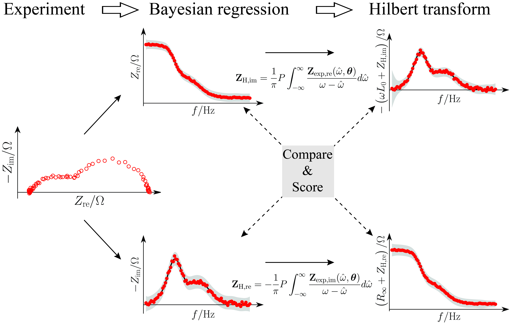

# Bayesian Hilbert Transform (BHT)

## Project

This repository contains an implementation of the source code used for the paper entitled "A Bayesian View on the Hilbert Transform and the Kramers-Kronig Transform of Electrochemical Impedance Data: Probabilistic Estimates and Quality Scores" https://www.sciencedirect.com/science/article/pii/S0013468620312573. The preprint is also available in the [docs](docs) folder.

## Description
Electrochemical impedance spectroscopy (EIS) is one of the most widely used experimental tools in electrochemistry and has applications ranging from energy storage and power generation to medicine. Considering the broad applicability of the EIS technique, it is critical to validate the EIS data against the Hilbert transform (HT) or, equivalently, the Kramers–Kronig relations. These mathematical relations allow one to assess the self-consistency of obtained spectra. However, the use of validation tests is still uncommon. In the present article, we aim at bridging this gap by reformulating the HT under a Bayesian framework. In particular, we developed the Bayesian Hilbert transform (BHT) method that interprets the HT probabilistically. Leveraging the BHT, we proposed several scores that provide quick metrics for the evaluation of the EIS data quality. 


<div align='center'><strong>Figure 1. Schematic illustration of the Bayesian Hilbert transform method.</strong></div>

## Dependencies

`numpy`

`scipy`

`matplotlib`

`seaborn`

`pandas`


## Tutorials

* **ex1_ZARC.ipynb**: this tutorial illustrates how the BHT-DRT works using a simple ZARC model.
* **ex2_two-ZARCs.ipynb**: this tutorial is similar to the above one, but with a more complicated model, i.e., two-ZARCs model.
* **ex3_drift.ipynb**: in this tutorial, we evaluate the BHT-DRT performance with the EIS spectrum that has a drift. The drift is imposed on the polarization resistance. 
* **ex4_MoS2_exp.ipynb**: in this example tutorial, we demonstrate that the BHT-DRT is also available for the unbounded impedance, e.g., the impedance data for a sodium ion battery. 
* **ex5_failed.ipynb**: the last tutorial shows how the BHT-DRT is able to detect the inconsistency of the impedance data.

## Citation

```
@article{LIU2020BHT,
	author = "Jiapeng Liu and Ting Hei Wan and Francesco Ciucci",
	title = "A Bayesian View on the Hilbert Transform and the Kramers-Kronig Transform of Electrochemical Impedance Data: Probabilistic Estimates and Quality Scores",
	journal = "Electrochimica Acta",
	pages = "136864",
	year = "2020",
	issn = "0013-4686",
	doi = "10.1016/j.electacta.2020.136864",
	url = "http://www.sciencedirect.com/science/article/pii/S0013468620312573",
}
```

## References

1. Ciucci, F. (2018). Modeling electrochemical impedance spectroscopy. Current Opinion in Electrochemistry.132-139 [doi.org/10.1016/j.coelec.2018.12.003](https://doi.org/10.1016/j.coelec.2018.12.003)
2. Saccoccio, M., Wan, T. H., Chen, C., & Ciucci, F. (2014). Optimal regularization in distribution of relaxation times applied to electrochemical impedance spectroscopy: ridge and lasso regression methods-a theoretical and experimental study. Electrochimica Acta, 147, 470-482. [doi.org/10.1016/j.electacta.2014.09.058](https://doi.org/10.1016/j.electacta.2014.09.058)
3. Wan, T. H., Saccoccio, M., Chen, C., & Ciucci, F. (2015). Influence of the discretization methods on the distribution of relaxation times deconvolution: implementing radial basis functions with DRTtools. Electrochimica Acta, 184, 483-499. [doi.org/10.1016/j.electacta.2015.09.097](https://doi.org/10.1016/j.electacta.2015.09.097)
4. Ciucci, F., & Chen, C. (2015). Analysis of electrochemical impedance spectroscopy data using the distribution of relaxation times: A Bayesian and hierarchical Bayesian approach. Electrochimica Acta, 167, 439-454. [doi.org/10.1016/j.electacta.2015.03.123](https://doi.org/10.1016/j.electacta.2015.03.123)
5. Effat, M. B., & Ciucci, F. (2017). Bayesian and hierarchical Bayesian based regularization for deconvolving the distribution of relaxation times from electrochemical impedance spectroscopy data. Electrochimica Acta, 247, 1117-1129. [doi.org/10.1016/j.electacta.2017.07.050](https://doi.org/10.1016/j.electacta.2017.07.050)
6. Liu, J., & Ciucci, F. (2019). The Gaussian process distribution of relaxation times: A machine learning tool for the analysis and prediction of electrochemical impedance spectroscopy data. Electrochimica Acta, 135316. [doi.org/10.1016/j.electacta.2019.135316](https://doi.org/10.1016/j.electacta.2019.135316)
7. Liu, J., & Ciucci, F. (2020). The Deep-Prior distribution of relaxation Times. Journal of The Electrochemical Society, 167(2), 026506. [10.1149/1945-7111/ab631a](https://iopscience.iop.org/article/10.1149/1945-7111/ab631a/meta)
8. Ciucci, F. (2020). The Gaussian Process Hilbert Transform (GP-HT): Testing the Consistency of Electrochemical Impedance Spectroscopy Data. Journal of the Electrochemical Society. [10.1149/1945-7111/aba937](https://iopscience.iop.org/article/10.1149/1945-7111/aba937/meta)
